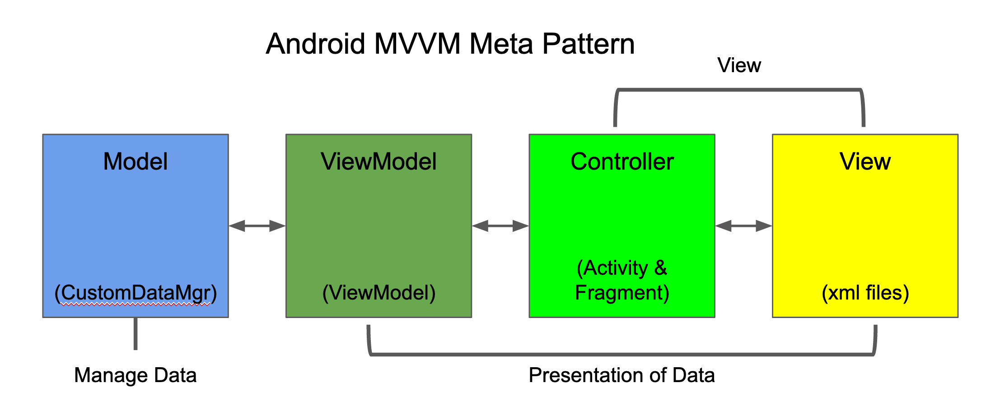

# the tao of android 

Perceive the software universe through the eyes of the Android masters and power your android Chi to solve software riddles.

## Riddle Me This - What is the Android meta pattern?
Listen and learn my padawan.

To learn the mysteries of Android you must grasp the Android meta pattern, Model-View-ViewModel (MVVM). 

[Model-View-ViewModel](https://en.wikipedia.org/wiki/Model%E2%80%93view%E2%80%93viewmodel)

This meta pattern breaks Android applications into 4 conceptual parts each with their own roles to play in making a harmonious application whole.
 
 

 
 
- **Model** : The mysteries of data are solved here. To create, read, update and delete data (CRUD) (to see more information on the power of CRUD click [here](https://en.wikipedia.org/wiki/Create,_read,_update_and_delete)). 
  - The purpose of the model is to isolate all data storage, data retrieval, data updates data integration and business logic away from view and controller parts of your application so they do not have to know or care about these mysteries. 
  <add example code>
- **ViewModel**: The view model is a bridge that converts the data provided by the model to make display and presentation of the data as easy as possible.
  - In Android this is typically a ViewModel class associated with a Activity or Fragment.
  - Use LiveData and MutableLiveData to provide data updates.
  - It also solves the problem of Activities or Fragments being destroyed when a phone is rotated.
  <add example code>
- **Controllers**: Typically Activities and Fragments used to bind data provided by the Model/ViewModel to the Views.
  <add example code>

- **Views**: Typically XML layout files that are data agnostic and used to display information. 
  <add example code>

## Question: are there other software paths that the Google has choose not to take?

Yes, my padawan.

Android uses an object oriented programming (OOP) approach. See,
[Object Oriented Programming](https://en.wikipedia.org/wiki/Object-oriented_programming)

This is venerable software way is based on the concept of classes and objects made of up of data and methods. Classes are the templates from which objects are created. This fusion of data and methods allows for the creation of a harmonious software whole. Each object knows its role and place in the applications universe. By followig the MVVM way the Google forsook the simplicity of the pure OOP ideal and added concepts of separation of data and UI from each other. 

Although this increased the conceptual knowledge need to use Android, I believe this decision was a wise one, as in practice the mysteries of data (the Model) are often complex and difficult grasp and by separating it to its own domain an application becomes easier to understand and maintain.

<add in section on memory management>

## Question - Why has Android not embraced the MVC way?

Ah, the Model View Controller (MVC) pattern is well loved by many, especially amoung those who have followed the Apple path. 

[Model-View-Controller](https://en.wikipedia.org/wiki/Model%E2%80%93view%E2%80%93controller)

For many years the MVC way was embraced by the Google. However, the dreaded *[rotate phone bug](https://stackoverflow.com/questions/27233787/why-the-android-activity-gets-destroyed-on-rotation)*, a persistent thorn to all Android masters and padawans, was only plucked out by the advent of ViewModels and the adoption of the MVVM way. 
>## Enlightenment: Embrace the Google Way
>Although the Google is fallible (see our contemplation on the MVP way), for the wise sofware padawan it is best to embrace the Google way when traveling the Android path to software enlightenment.

## The Riddle of the Model (YourDataManager)
## The Riddle of the ViewModel (ViewModel)
## The Riddle of the Controller (Activies/Fragments)
## The Riddle of Views (XML)
## The Riddle of Pointers (memory management)